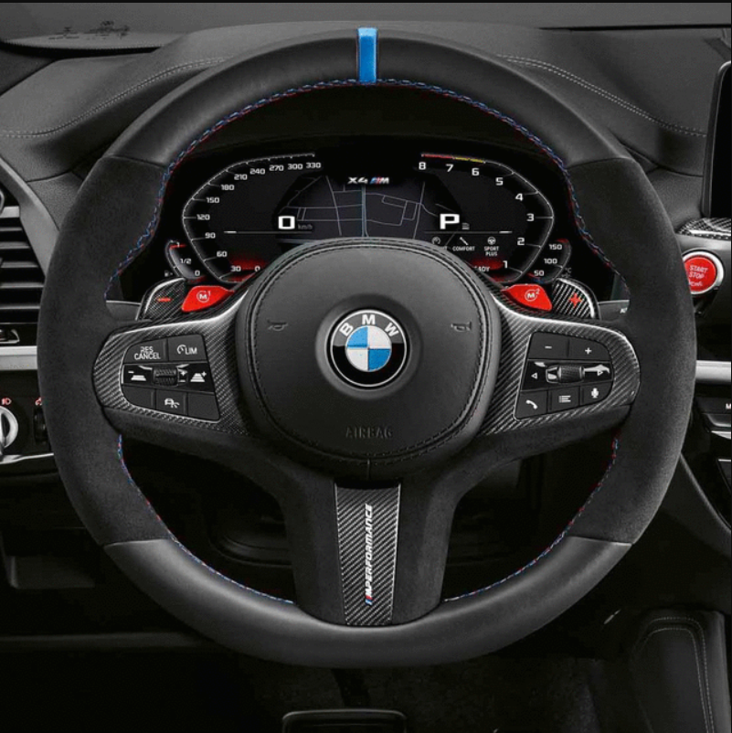
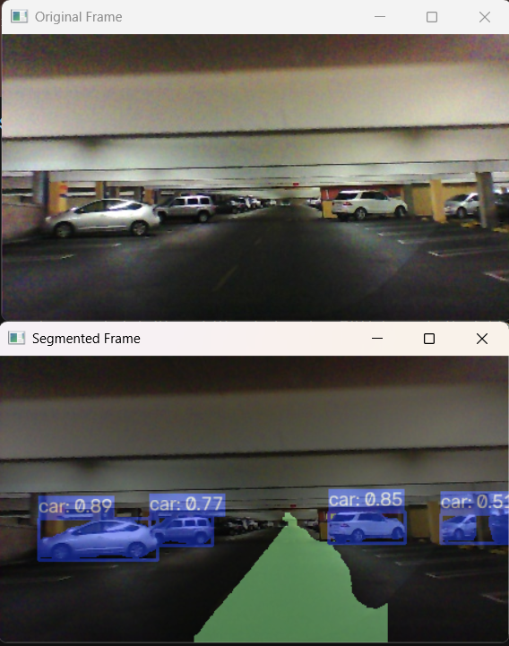
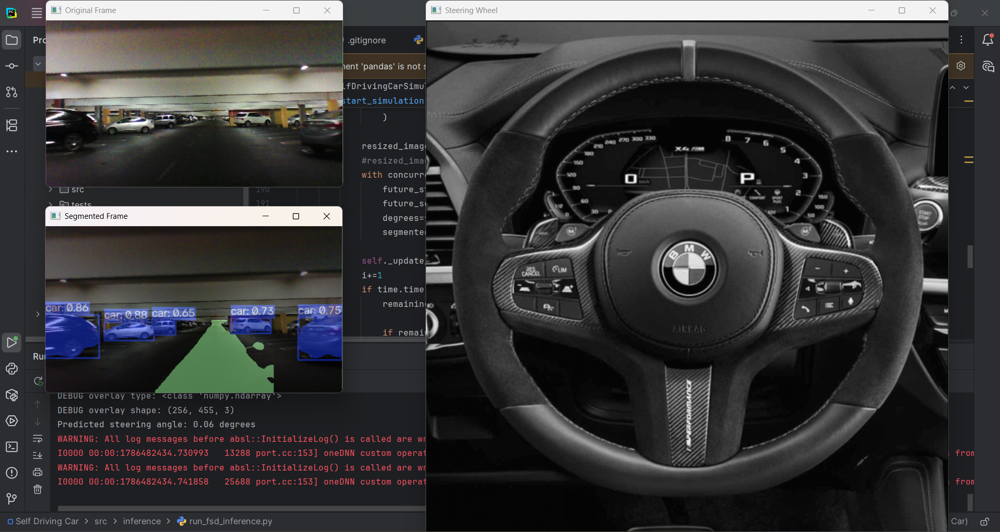

<div align="center">

# 🚗 Self-Driving Car
### An End-to-End Autonomous Driving Perception & Control Pipeline

**Real-time steering prediction · Lane segmentation · Object detection — fused into one live driving system**

<p>
  
  
  
  
  
  
</p>

*A from-scratch implementation of the perception → decision pipeline that underlies modern ADAS and autonomous vehicle stacks — built to demonstrate applied computer vision, deep learning, and real-time systems engineering.*

</div>

---

## 📑 Table of Contents

- [Why This Project](#-why-this-project)
- [Demo](#-demo)
- [Overview](#-overview)
- [Key Features](#-key-features)
- [Architecture](#️-architecture)
- [Tech Stack & Skills Demonstrated](#-tech-stack--skills-demonstrated)
- [Repository Structure](#-repository-structure)
- [Installation](#️-installation)
- [Dataset](#️-dataset)
- [Usage](#-usage)
- [Models Used](#-models-used)
- [Roadmap](#️-roadmap)
- [Acknowledgements](#-acknowledgements)
- [License](#-license)
- [Author](#-author)

---

## 🎯 Why This Project

This project mirrors the core **perception stack** found in real autonomous-vehicle and ADAS systems, condensed into a single, inspectable codebase:

| Real-world AV capability | Implemented here |
|---|---|
| Path/steering prediction from raw camera feed | NVIDIA-style end-to-end CNN regression |
| Drivable-area / lane understanding | Fine-tuned YOLO11 segmentation |
| Surrounding-object awareness | YOLO11n-seg detection + instance masks |
| Real-time multi-model sensor fusion | Concurrent multi-threaded/multi-process inference |
| Human-interpretable output | Live animated steering wheel + segmented overlay |

It's designed to be readable end-to-end — from raw pixels, to trained weights, to a running simulation — making it a compact reference for how a CV/ML engineer approaches a multi-model, real-time perception problem.

## 📸 Demo

> Add your own screenshots/GIFs to a `screenshots/` folder in the repo root and reference them below. Placeholders are shown here — swap in your images once you have them.

| Steering Prediction | Lane + Object Segmentation | Combined Simulation |
|:---:|:---:|:---:|
|  |  |  |

---

## 📖 Overview

This repository combines three deep-learning models into a single real-time driving simulation pipeline:

1. **Steering Angle Regression** — a 5-layer convolutional neural network (inspired by NVIDIA's *"End to End Learning for Self-Driving Cars"* paper) that takes a road image and predicts the steering wheel angle.
2. **Lane Segmentation** — a YOLO11 segmentation model fine-tuned to detect drivable lane regions.
3. **Object Detection & Segmentation** — a YOLO11n-seg model that detects and segments surrounding vehicles, pedestrians, and other objects on the road.

All three models run concurrently (multi-threaded/multi-process) on each frame, and the results are composited into a live view: the original frame, a segmented overlay, and an animated steering wheel that rotates according to the predicted angle.

## ✨ Key Features

- 🧠 **CNN-based steering angle prediction** trained end-to-end from raw pixels to steering command
- 🛣️ **Real-time lane segmentation** using a fine-tuned YOLO11 model
- 🚦 **Object detection & instance segmentation** for surrounding traffic using YOLO11n-seg
- ⚡ **Parallelized inference** — steering, lane, and object models run concurrently via `concurrent.futures`
- 🎡 **Animated steering wheel visualization** that smoothly rotates with predicted angle
- 🏋️ **Training scripts** to reproduce the steering model from scratch, with TensorBoard logging
- 📦 **Installable as a package** (`setup.py`) with CLI entry points for inference

## 🏗️ Architecture

```
                ┌────────────────────┐
   Dash-cam ──▶ │   Frame Capture     │
    Video       └─────────┬──────────┘
                           │
             ┌─────────────┼──────────────┐
             ▼             ▼              ▼
     ┌───────────────┐ ┌───────────┐ ┌─────────────────┐
     │ Steering CNN   │ │ YOLO11    │ │ YOLO11n-seg      │
     │ (PilotNet-style│ │ Lane      │ │ Object Detection │
     │  regression)   │ │ Segment.  │ │ + Segmentation   │
     └───────┬────────┘ └─────┬─────┘ └────────┬─────────┘
             │                └────────┬────────┘
             ▼                         ▼
     ┌───────────────┐        ┌────────────────────┐
     │ Steering Wheel │        │  Composited Overlay │
     │  Animation     │        │  (lanes + objects)  │
     └───────────────┘        └────────────────────┘
```

### Steering Angle CNN

A 5 convolutional + 5 fully-connected layer network, implemented in TensorFlow 1.x compatibility mode:

| Layer | Type | Output |
|---|---|---|
| Input | Image | 66 × 200 × 3 |
| Conv1–3 | 5×5 kernel, stride 2 | 24 → 36 → 48 filters |
| Conv4–5 | 3×3 kernel, stride 1 | 64 filters |
| FC1–4 | Fully connected + dropout | 1164 → 100 → 50 → 10 |
| Output | `2 · atan(FC5)` | Steering angle (rad) |

The final `atan` activation scaled by 2 constrains the output to a realistic steering range, following the original NVIDIA PilotNet design.

## 🧠 Tech Stack & Skills Demonstrated

<table>
<tr>
<td valign="top" width="50%">

**Deep Learning & CV**
- Convolutional neural network design (regression head, `atan`-scaled output)
- Transfer learning / fine-tuning YOLO11 for domain-specific segmentation
- Instance segmentation & object detection (YOLO11n-seg)
- Model checkpointing & TensorBoard experiment tracking

</td>
<td valign="top" width="50%">

**Engineering & Systems**
- Concurrent, multi-model real-time inference (`concurrent.futures`)
- Modular, packageable Python project (`setup.py`, CLI entry points)
- OpenCV-based image I/O, preprocessing, and live visualization
- Clean separation of training, inference, and model code

</td>
</tr>
</table>

**Core Stack:** Python · TensorFlow (1.x compat) · Ultralytics YOLO11 · OpenCV · NumPy · Keras · Matplotlib

## 📁 Repository Structure

```
Self-Driving-Car/
├── data/
│   └── steering_wheel_image.png        # Icon used for the animated wheel overlay
├── model_training/
│   └── train_steering_angle/
│       ├── data/steering_wheel_image.png
│       ├── model.py                    # CNN architecture (training copy)
│       ├── driving_data.py             # Dataset loader / train-val split
│       └── train.py                    # Training loop + checkpointing + TensorBoard
├── saved_models/
│   ├── lane_segmentation_model/
│   │   └── best_yolo11_lane_segementation.pt
│   ├── object_detection_model/
│   │   └── yolo11n-seg.pt
│   └── regression_model/
│       ├── model.ckpt.index
│       ├── model.ckpt.data-00000-of-00001
│       ├── model.ckpt.meta
│       └── checkpoint
├── src/
│   ├── inference/
│   │   └── run_fsd_inference.py        # Main simulator: steering + segmentation pipeline
│   └── models/
│       └── model.py                    # CNN architecture (inference copy)
├── tests/
│   └── model.py                        # Standalone model definition used in tests
├── requirements.txt
├── setup.py                             # Packaging + CLI entry points
└── README.md
```

## ⚙️ Installation

```bash
# 1. Clone the repository
git clone https://github.com/Optimus0205/Self-Driving-Car.git
cd Self-Driving-Car

# 2. (Recommended) Create a virtual environment
python -m venv venv
source venv/bin/activate      # On Windows: venv\Scripts\activate

# 3. Install dependencies
pip install -r requirements.txt

# 4. Install the project in editable mode (registers CLI entry points)
pip install -e .
```

### Requirements

```
tensorflow
opencv-python
numpy
pandas
matplotlib
keras
ultralytics
```

## 🗃️ Dataset

The `driving_data.py` loader expects a driving dataset at `data/driving_dataset/` with a `data.txt` index file where each line is:

```
<image_filename> <steering_angle_in_degrees>
```

This matches the format of the classic dash-cam steering datasets commonly used to reproduce NVIDIA's end-to-end driving paper (e.g., Sully Chen's driving dataset). Download a compatible dataset and place it at:

```
data/driving_dataset/
├── data.txt
├── 0.jpg
├── 1.jpg
└── ...
```

> **Note:** The dataset itself is not included in this repository due to its size — only a sample `steering_wheel_image.png` is checked in.

## 🚀 Usage

### Train the steering angle model

```bash
cd model_training/train_steering_angle
python train.py
```

- Checkpoints are saved to `save/model.ckpt`
- Training loss is logged for TensorBoard:

```bash
tensorboard --logdir=logs
# then open http://0.0.0.0:6006/
```

### Run the full self-driving simulation

Runs steering prediction + lane segmentation + object detection together and displays three live windows (original frame, segmented overlay, animated steering wheel):

```bash
python -m src.inference.run_fsd_inference
```

Or, after installing the package, via the CLI entry point:

```bash
run_fsd_inference
```

Press `q` in the display window to stop the simulation.

## 🧩 Models Used

| Component | Model | Location |
|---|---|---|
| Steering angle regression | Custom CNN (TensorFlow 1.x, checkpoint) | `saved_models/regression_model/` |
| Lane segmentation | Fine-tuned YOLO11 (Ultralytics) | `saved_models/lane_segmentation_model/` |
| Object detection & segmentation | YOLO11n-seg (Ultralytics) | `saved_models/object_detection_model/` |

## 🗺️ Roadmap

- [ ] Add automated tests / CI
- [ ] Add a `LICENSE` file (project is declared MIT in `setup.py`)
- [ ] Migrate steering model to TensorFlow 2.x native API
- [ ] Add sample dataset / demo video for quick testing
- [ ] Package Dockerfile for reproducible environment setup

## 🙏 Acknowledgements

- NVIDIA's *["End to End Learning for Self-Driving Cars"](https://arxiv.org/abs/1604.07316)* paper — architecture inspiration for the steering CNN
- [Ultralytics YOLO11](https://github.com/ultralytics/ultralytics) — lane segmentation and object detection backbone

## 📄 License

This project is intended to be released under the **MIT License** (as declared in `setup.py`). Add a `LICENSE` file to the repository root to make this official.

## 👤 Author

**Ashutosh Singh** — [@Optimus0205](https://github.com/Optimus0205)

*Open to feedback, collaboration, and opportunities in Computer Vision / Applied ML. Feel free to open an issue or connect via GitHub.*

<div align="center">

⭐ **If this project is useful or interesting, consider starring the repo!** ⭐

</div>
